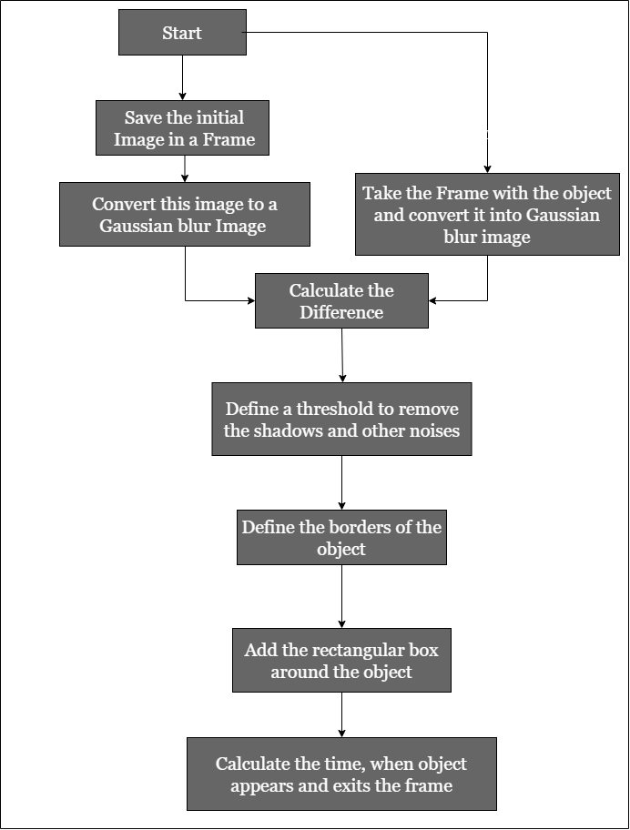

# Surveillance Motion Detection Using OpenCv

In this project, we wanted to create a surveillance motion detection system that can not only
detect motion but also notify the user of the intrusion, capture film from the
moment the motion was detected, and raise the alarm system and as well as
store csv file at the moment when motion was recorded. In this system it can
even possible to send SMS to user when any intrusion happen. The system
architecture work in the following manner that is we
must first acquire live photos of the area to be observed and kept under
observation in order to detect motion. This is accomplished by utilizing a
webcam that continuously transmits a succession of photos at a specific frame
rate (frames per second). In this project we are going to use OpenCV Library of Python inorder to detect any movement.

## Python Libraries Required
First we need to ensure that we have installed Python in our system. Then we have to install and import the following libraries/modules in our code.

* OpenCV (This library is used for computer vision and image processsing.)

* Pandas (This library is used for manipulating and analyzing data.)

* Pyttsx3 (This library is used to convert text-to-speech.) 

* Threading (This library is used for creating, controlling and managing threads in Python.)

* Bokeh (This library is used for making highly interactive graphs and visualization.)

* Time (This module in Python provides functions for handling time-related tasks.)
## Work Flow

## Anaylsis of Frames
After running the code there 4 new frames/windows will appear on screen.

1. Gray Frame:
In Gray frame the image is a bit blur and in grayscale we did so because, In gray pictures there is only one intensity value whereas in RGB(Red, Green and Blue) image thre are three intensity values. So it would be easy to calculate the intensity difference in grayscale.

2. Difference Frame:
Difference frame shows the difference of intensities of first frame to the current frame.

3. Threshold Frame:
If the intensity difference for a particular pixel is more than 30(in my code) then that pixel will be white and if the difference is less than 30 that pixel will be black.

4. Color Frame:
In this frame we can see the color images in color frame along with green contour(frame) around the moving objects.

Note : To escape from all this frames, press 'Q'.
## Time of Motion
The Times file will be stored in the folder where our code file is stored. This file will be in csv extension. In this file the start time of motion and the end time of motion will be recorded.
## Plotting of Time Interval Graph
Time Intervals will be plotted using Bokeh Plot. Bokeh is an interactive visualization library that targets modern web browsers for presentation. Here, the time intervals are collected by the csv file and then plotted using Bokeh. The green color shows that an object was under motion, time is displayed in milisecond(ms). Graph1 will be the output file in which plotting will be displayed. This file will be in html extension hence would be opened easily in any browser.
## Python Files
Our project consists of two python files :

1. detectmotion.py :
It conatins the code for Motion Detection. By running this file we can detect the motion in front of webcam and can record the start and end time of motion. Also we get alerts in the form of aduio from system of motion being detected in each movement of object infront of webcam. 

2. plot.py : 
It makes use of Boken Library. By running this file we can plot the time intervals. This file imports the code of motion detection from detectmotion.py, hence we need to put both detectmotion.py and plot.py in a same repository.

## Author

_*Aniket Umare*_

